# Technical Architecture — @thataipm Content Pipeline

Reference document for the full system built this session: script to scheduled post, with
every real tool/service involved. Written 2026-08-10 once the pipeline had a real episode
(`best-ai-tools-for-voiceovers`) go through it end to end. For deep technical detail on any
individual piece (exact pitfalls, API quirks, historical decisions), see `CLAUDE.md` and the
`docs/` files this document links to — this is the map, not the territory.

## 1. What this system is

A vertical-video production and distribution pipeline for a faceless Instagram/YouTube/LinkedIn
channel. One person (plus this assistant) takes a topic from the content calendar through to a
scheduled, ready-to-publish post on all three platforms — real screenshots, real pricing, real
voiceover, no stock templates or invented claims anywhere in the chain.

Three layers, each independently replaceable:

1. **Planning** — what to make (`docs/*.md`)
2. **Production** — turning a script into a rendered video (`remotion/`, `automation/`)
3. **Distribution** — hosting the output and getting it scheduled on each platform (GitHub +
   Zernio)

## 2. Workflow diagram

```mermaid
flowchart TD
    subgraph Plan["1. Planning"]
        A1[30-day calendar\ndocs/30_day_content_calendar.md] --> A2[Pick today's topic]
        A2 --> A3[Research real facts\nWebSearch/WebFetch\nverify tool still live]
    end

    subgraph Script["2. Script"]
        A3 --> B1[Write VO script\nepisodes/id/id_script.md]
        B1 --> B2{Approved?}
        B2 -- no --> B1
    end

    subgraph Produce["3. Production"]
        B2 -- yes --> C1[generate_vo.py --timestamps\nElevenLabs API]
        C1 --> C2[derive_word_timing.py\nper-shot cut + word-level timing]
        C2 --> C3[Gather real assets\ncapture_product_screenshot.py\nlogos via favicon/press-kit]
        C3 --> C4[Build shot components\nRemotion / React TSX]
        C4 --> C5[npx remotion render\ncheckpoint stills first]
        C5 --> C6[ffmpeg volumedetect\naudio sanity check]
        C6 --> C7[Render cover image\nnpx remotion still]
        C7 --> C8[Write captions.md\ndistinct copy per platform]
    end

    subgraph Host["4. Hosting"]
        C8 --> D1[git push to\ngithub.com/thataipm/contentengine]
        D1 --> D2[raw.githubusercontent.com URL\nverified via curl before use]
    end

    subgraph Distribute["5. Distribution"]
        D2 --> E1[Zernio: presign + upload media\nPOST /v1/media/presign then PUT bytes]
        E1 --> E2[Zernio: create post\nPOST /v1/posts per platform]
        E2 --> E3[Set isDraft:false + scheduledFor\ntogether -- the one that silently\nno-ops if sent separately]
        E3 --> E4[Verify via GET /v1/posts?status=scheduled\nnever trust the response body alone]
        E4 --> F[Live on Instagram / YouTube\nLinkedIn scheduled manually]
    end

    style Plan fill:#8C7CFF22,stroke:#8C7CFF
    style Script fill:#FF9B5422,stroke:#FF9B54
    style Produce fill:#6FE0A022,stroke:#6FE0A0
    style Host fill:#5FC4E022,stroke:#5FC4E0
    style Distribute fill:#8C7CFF22,stroke:#8C7CFF
```

## 3. Planning layer

- **`docs/thataipm_pillar2_content_plan.md`** — the two content pillars and their locked idea
  banks: Main pillar (Trending Claude Code skills, 60%) and Best AI Tools (ranked listicles by
  industry category, 40%).
- **`docs/30_day_content_calendar.md`** — the actual day-by-day posting schedule, interleaving
  the two pillars, tracking what's shipped vs. planned.
- Every topic gets fact-checked before scripting, not assumed from memory — this caught PlayHT
  being defunct and Resemble AI having pivoted to a different business entirely, both mid-plan.

## 4. Production layer

**Render engine** (`remotion/`, React + TypeScript, Remotion framework):

| Piece | Role |
|---|---|
| `theme.ts` / `theme_skills.ts` | Canvas size, fonts, color palette |
| `motion.ts` | Shared animation primitives (`springIn`, `edgeFadeVolume`) |
| `Episode.tsx` | Sequences shots via `<TransitionSeries>`, draws watermark/progress bar once globally |
| `components/ContentZone.tsx` | Vertically centers shot content in the real available space |
| `components/ProductScreenshot.tsx` | Real product screenshot with pan/zoom into one detail |
| `components/Sfx.tsx` | Synced sound cues (tick/whoosh/chime) |
| `components/CaptionsPop.tsx` | Karaoke-style word-highlight captions, driven by real word timing |

**Automation scripts** (`automation/`, Python):

| Script | Role |
|---|---|
| `generate_vo.py --timestamps` | ElevenLabs TTS + character-level alignment |
| `derive_word_timing.py` | Splits VO into per-shot audio + frame-accurate word timing |
| `capture_product_screenshot.py` | Playwright capture of a real public product page |

**The standing rule underneath all of it**: every visual is either a real captured asset (a
screenshot, a real logo) or is driven by real data (real word timing, real prices) — never a
placeholder or an invented number. This is slower than templating but is the actual differentiator
of the channel.

## 5. Hosting layer

The render output has nowhere to live that Zernio (or any posting tool) can reach until it's on
a public URL. This project uses a public GitHub repo
(`github.com/thataipm/contentengine`) as that layer:

1. Render locally → `episodes/{slug}/build/{slug}.mp4` + cover + captions.
2. `git add` + commit + push (the actual publish step here has repeatedly needed the user to
   run it directly — see `CLAUDE.md`'s notes on the auto-mode safety classifier blocking
   `git commit`/`push` from this assistant in several sessions).
3. Verify the `raw.githubusercontent.com` URL actually serves the file (`curl -I`, check
   `Content-Length` matches the local file exactly) before ever handing it to a posting tool —
   this caught real problems twice (Google Drive links degrading under repeated fetch, a stale
   cached asset after a re-render).

This was evaluated against several alternatives (Google Drive links — unreliable for repeated
third-party fetches; various paid hosts) before landing here. GitHub works well up to roughly
1GB of accumulated repo size before it stops being the right tool (see the Buffer-era research
in `project_posting_automation` memory for the exact math) — worth revisiting hosting once this
channel has been running for several months.

## 6. Distribution layer

**Current tool: Zernio** (`zernio.com`), reached via direct HTTP API calls (no MCP server exists
for it, unlike Buffer/Postiz/SocialClaw which were evaluated and rejected first — see
`project_posting_automation` memory for the full comparison: Buffer's channel gating broke
after a plan change, SocialClaw's free tier blocked agent access entirely even on a paid-adjacent
trial).

**Real flow, as it actually works (not as first assumed)**:

1. `POST /v1/media/presign` with `filename`, `contentType`, `fileSize` → returns a presigned R2
   upload URL and the eventual public URL.
2. `PUT` the raw file bytes to that upload URL.
3. `POST /v1/posts` with `content`, `mediaItems` (video URL, plus `thumbnail` for YouTube or
   `instagramThumbnail` for Instagram Reels — both real custom-thumbnail support Buffer never
   had), and a `platforms` array with per-platform `accountId` + `platformSpecificData`.
4. **The scheduling gotcha**: a freshly created post defaults to `status: "draft"` unless
   `scheduledFor` is provided at creation. If you need to *update* an existing draft into a
   scheduled post, sending `scheduledFor` alone does nothing — the post silently keeps its draft
   status. You must send `isDraft: false` together with `scheduledFor` in the same request. This
   isn't documented consistently across Zernio's own docs pages (one page's example was simply
   wrong) — caught by verifying the actual post state via `GET /v1/posts?status=scheduled`
   rather than trusting the 200 response body, which looked correct even when it wasn't.
5. LinkedIn is posted manually by the user, not through Zernio — a deliberate choice, not a
   limitation being worked around.

## 7. Known open items

- `remotion/`'s own source code isn't in the GitHub repo yet — a leftover nested `.git` from
  however the project was originally scaffolded blocks it from being tracked, and removing that
  nested `.git` has repeatedly been blocked by this assistant's own safety classifier. Only
  rendered *outputs* are backed up right now, not the code that produces them.
- CTA fulfillment (what actually happens when someone comments the keyword) is still undecided.
- The next 30-day cycle's Best-AI-Tools category bank runs out after 10 categories; needs
  either repeat categories with different tools or new categories added before Day 27.
